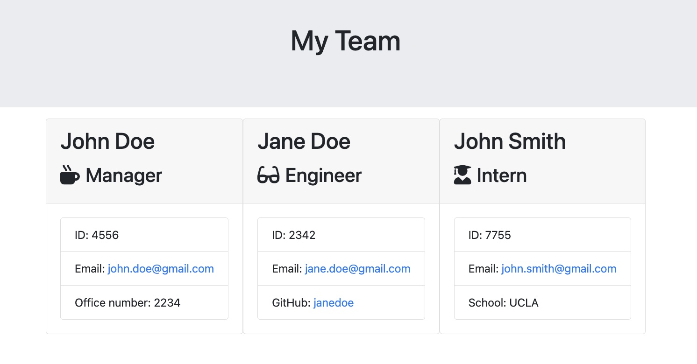

## Deliverable

## Deliverable

Github - https://github.com/rhen-quadros/Team-Profile-Generator
Github Pages - https://rhen-quadros.github.io/Team-Profile-Generator/output/team.html

# Team Profile Generator

## Description

As a manager a user want to generate a webpage that displays my team's basic info so that a user have quick access to their emails and GitHub profiles.

## Table of Contents

- [Installation](#installation)
- [Usage](#usage)
- [License](#license)
- [Contributing](#contributing)
- [Tests](#tests)
- [Questions](#questions)

## Installation

run `npm i` and `npm run test` then run `node index` and follow the prompts then view index.html

## Usage

MIT

## License

This project is covered under the MIT License

## Contributing

na

## Tests

TDD

## Questions

Reach out for additional questions at: rhenq4@gmail.com
